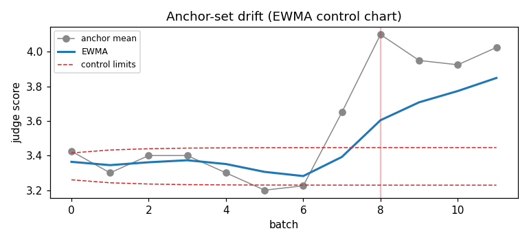
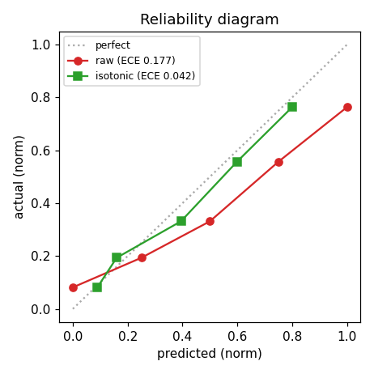

# Eval của bạn cũng cần một eval: đo độ tin cậy của LLM-as-Judge

*Bài 4 — series Data Reliability. Thay vì đo model, lần này ta đo chính cái thước.*

## 1. Vấn đề: con số eval là một phép đo, nhưng không ai hiệu chuẩn cái thước

LLM-as-judge giờ là xương sống của đánh giá model: rẻ, nhanh, scale được tới
hàng chục nghìn mẫu. Nhưng một điểm `7.2/10` từ judge **là một phép đo** — và
như mọi phép đo, nó vô nghĩa nếu không kèm hai bằng chứng:

- **Reliability** — đo lại có ra cùng kết quả không?
- **Validity** — nó có đo đúng cái ta tưởng không?

Trong khi ta bắt model phải qua test, qua CI, qua error bar, thì cái *thước* đo
model lại được tin tưởng mù quáng. Bài này biến eval pipeline thành đối tượng
được audit — đúng tinh thần data reliability của cả series: *nếu không đo được
độ tin cậy của dữ liệu/dụng cụ, thì mọi kết luận phía sau là cát lún.*

Đi kèm bài là package `judge-audit` (pure NumPy) và một benchmark
**inject → recover**: dựng một judge tổng hợp với các bệnh đã biết trước, rồi
chứng minh công cụ *bắt lại được* đúng các bệnh đó — cùng triết lý với
model-collapse-testbed (gài tín hiệu, chứng minh dụng cụ tìm ra).

## 2. Ba trục đo

### Trục 1 — Reliability & Validity

**Self-consistency là trần của mọi thứ.** Chấm cùng một item R lần ở
`temperature > 0`. Nếu judge không nhất quán với *chính nó*, thì mọi bảng xếp
hạng phía sau chỉ là noise. Đo bằng Krippendorff's α (coi R lần chấm như R
rater) + flip-rate.

**Validity** = đồng thuận với người. Spearman ρ cho thứ hạng; Krippendorff's α
(interval) cho mức độ trùng khít trên thang điểm. Krippendorff α được chọn vì
xử lý được ordinal Likert + missing + nhiều rater — đúng hình dạng dữ liệu eval.

> Lưu ý kỹ thuật: implementation Krippendorff trong package được cross-check
> khớp **chính xác** tới 4 chữ số với package reference trên ví dụ canonical
> (nominal 0.7375 / ordinal 0.8495 / interval 0.8553).

### Trục 2 — Bias có hệ thống (đo bằng *controlled perturbation*)

Quan sát thụ động không đủ — phải chủ động nhiễu loạn biến gây nhiễu:

- **Position bias** (pairwise): chấm cùng một cặp ở cả hai thứ tự `(A,B)` và
  `(B,A)`. Judge trung lập sẽ chọn cùng *nội dung* bất kể vị trí. Đo
  *flip-rate* (thứ tự làm đảo phán quyết) và *first-slot rate* (0.5 = trung
  lập; > 0.5 = thiên vị vị trí đầu).
- **Verbosity bias**: hồi quy điểm theo `z(log-length)` *sau khi đã partial out
  chất lượng thật*. Hệ số ≠ 0 nghĩa là judge thưởng cho độ dài, không phải chất
  lượng. Dùng log vì token count là phân phối đuôi nặng.

### Trục 3 — Drift theo thời gian (chỗ nối thẳng vào series Lyapunov/lyapmon)

Provider âm thầm đổi version model; prompt template bị sửa; temperature bị
nhích. Bất kỳ cái nào cũng làm *trôi* thang điểm của judge mà không đụng tới
cái nó đo. Cách bắt:

1. Cố định một **golden anchor set** — vài chục item có nhãn người đồng thuận ổn định.
2. Chấm lại anchor set **mỗi batch**.
3. Chạy **control chart (EWMA + CUSUM)** trên anchor-mean. Vượt control limit = báo động.

Đây chính là drift-gate quen thuộc — chỉ khác là gate đặt trên *eval* thay vì
trên *model*.

## 3. Inject → recover: bằng chứng công cụ hoạt động

Judge tổng hợp được gài 5 bệnh với cường độ biết trước. Audit thu lại:

| bệnh gài vào | injected | recovered |
|---|---|---|
| verbosity coef (điểm / SD log-len) | 0.45 | 0.37¹ |
| self-consistency σ (điểm) | 0.40 | 0.32 |
| first-slot preference | 0.68 | 0.71 |
| changepoint của drift (batch) | 7 | 8² |
| calibration (ECE) | — | 0.177 → **0.042** sau isotonic |

¹ Làm tròn về thang Likert nguyên làm *suy giảm* hệ số đo được — hiệu ứng thật,
đúng như kỳ vọng, và bản thân nó là một bài học: discretization che bớt bias.
² EWMA trễ changepoint ~1 batch — đó là cái giá của smoothing.

Control chart bắt anchor-mean vọt qua giới hạn đúng batch 8 (drift bắt đầu ở 7).

## 4. Calibration: kéo điểm judge về thang người

Một judge có thể *reliable* mà vẫn *miscalibrated* — đều đặn cao hơn 0.6 điểm,
hoặc nén phần trên của thang. Fit **isotonic regression** (đơn điệu) từ
điểm-judge → điểm-người trên một calibration split, rồi áp lên test split.

ECE giảm `0.177 → 0.042` (−76%). Đường đỏ (raw) cong xuống dưới đường chéo —
judge nén phần điểm cao; đường xanh (isotonic) bám sát đường chéo.

## 5. Đừng đọc noise thành signal

Hai model lệch chất lượng thật 0.05 điểm. Judge báo `A − B = +0.030`, **95% CI
`[-0.16, +0.21]`**. CI vắt qua 0 ⇒ **không gọi được kẻ thắng**. Mọi khoảng cách
trên leaderboard phải có bootstrap CI; vắt qua 0 thì ghi *"không khác biệt có ý
nghĩa"*, đừng đôn lên thành kết luận.

## 6. Năm correction để mang vào production

| vấn đề | cách sửa |
|---|---|
| position bias | chấm cả hai thứ tự; chỉ tính khi hai thứ tự đồng thuận, còn lại đánh *tie/uncertain* |
| miscalibration | ship isotonic map; report điểm đã hiệu chỉnh + ECE, không dùng điểm thô |
| drift | giữ anchor-set control chart trong CI; báo động thì chặn run / re-baseline |
| reliability thấp | tăng repeats / giảm temperature trước khi tin bất kỳ ranking nào |
| leaderboard nhiễu | bootstrap CI mọi khoảng cách; vắt qua 0 ⇒ "không khác biệt có ý nghĩa" |

## 7. Kết

Cùng bộ kỹ thuật của series — drift monitor, anchor gate, inject-then-recover,
error bar — chỉ đổi đối tượng: lần này là cái thước, không phải vật được đo.
Thông điệp một câu: **eval của bạn cũng cần một eval.**

> Code + benchmark tái lập được: `judge-audit` (pure NumPy). Chạy
> `python examples/run_benchmark.py` để sinh lại report và hai biểu đồ trên.
